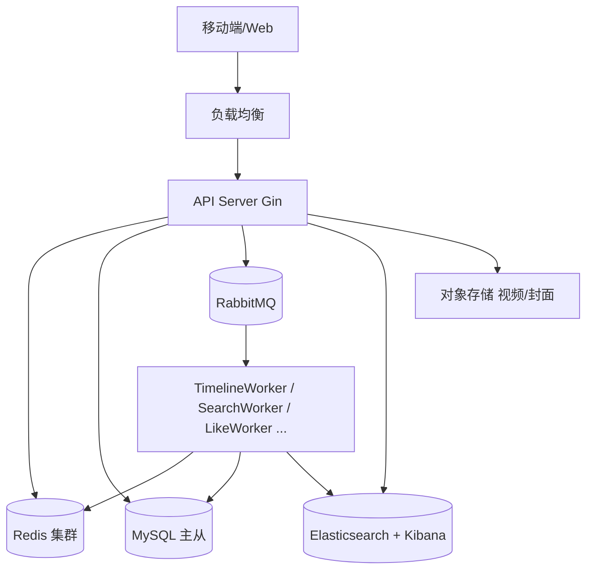

# TideFlow – 仿 TikTok 短视频 Feed 流系统

> **TideFlow** 是一个高性能、高可扩展的短视频 Feed 流后端系统，采用 **推拉结合** 与 **冷热分离** 架构，完美支撑类 TikTok 的全局最新、热门榜单、关注流三大时间线场景。

## 项目定位

TideFlow 为短视频平台提供**极致流畅的时间线体验**：
- 关注流：大 V 不发散推，普通博主主动推送，兼顾内存效率与新鲜度
- 全局最新：热 ZSET + 冷回源，瞬时百万视频快速截断
- 热门榜单：分钟级滑动窗口 + 快照缓存，实时热度不衰减
- 视频搜索：Elasticsearch + IK 分词，支持标题/用户名/描述/标签全文检索

## 核心特性

| 特性 | 实现方式 |
|------|----------|
| **推拉结合关注流** | 粉丝数 ≥ 1w 为大 V，仅写 Outbox；普通博主发布时异步推送到所有粉丝 Inbox（容量 1000） |
| **冷热分离** | Inbox 只存热数据，翻页触及边界时自动退化为拉模式（从博主发件箱/DB 补全并缓存 24h） |
| **三级缓存** | L1(go-cache) → L2(Redis) → L3(MySQL)，配合 singleflight + 软命中标记防止击穿 |
| **视频搜索** | Elasticsearch + IK 分词器，`multi_match` 多字段检索，结果通过三级缓存补全 |
| **分布式限流与锁** | Redis Lua 原子限流（登录、互动等），分布式锁保障详情回填等关键操作 |
| **事件驱动架构** | RabbitMQ 解耦视频发布、点赞、评论、关注等事件，各 Worker 独立伸缩 |
| **实时通知** | SSE 推送 + 站内通知表，毫秒级触达 |

## 技术架构



### 技术栈

- **语言**：Go 1.24.5
- **Web 框架**：Gin v1.11.0
- **数据库**：MySQL 8.0（GORM v1.31.1）
- **缓存**：Redis 7（go-redis v9）
- **消息队列**：RabbitMQ 3（amqp091-go）
- **搜索**：Elasticsearch 8.13 + IK 分词（go-elasticsearch v8）
- **可视化**：Kibana 8.13（端口 5601）
- **本地缓存**：go-cache v2.1
- **并发控制**：golang.org/x/sync
- **鉴权**：JWT v5

## 核心模块

### 1. 用户与账户
- JWT 双 Token（access 24h / refresh 7d）
- 注册、登录、密码修改、登出
- 用户资料与社交计数（粉丝/关注数）

### 2. 视频管理
- 分片上传 / 断点续传（5MB 分块，Redis Set 原子记录分块状态）
- 上传视频 / 封面 → 返回 URL
- 发布视频（标题、描述、标签）
- 视频详情（含作者信息、互动状态）
- 更新 / 软删除（仅作者）

### 3. 时间线 Feed（核心）
| 接口 | 数据源 | 特点 |
|------|--------|------|
| `/feed/latest` | `ZSET v1:feed:global` | 全局最新 1000 条，回源降级 |
| `/feed/popular` | 分钟热度窗口合并快照 | 滑动窗口自动衰减，ZUNIONSTORE 快照 |
| `/feed/following` | Inbox + 大V Outbox 合并 | 推拉结合，冷热分离，游标分页 |

### 4. 视频搜索
- `GET /api/v1/search/videos?q=关键词`（JWT 鉴权）
- Elasticsearch `multi_match` 多字段检索（title^3 / username^2 / description / tags）
- IK 分词器（ik_max_word / ik_smart）
- 支持按热度（popularity）或时间（create_time）排序
- 结果由三级缓存补全视频实体

### 5. 互动与热度
- 点赞 / 取消点赞（幂等）→ 更新 `likes_count` & `popularity`
- 评论（两层楼中楼）→ 更新热度权重
- 关注 / 取关 → 更新 `follower_count` 并推送通知

### 6. 通知与私信
- 站内通知（点赞、评论、关注）持久化 + SSE 实时推送
- 私信会话（未读数、已读状态）

## 数据流简图

### 视频发布
```
用户 POST /videos → MySQL(videos, outbox_msgs)
→ OutboxWorker 拉取 pending 事件
  ├─→ video.publish → TimelineWorker: ZADD 全局时间线 + Outbox
  └─→ search.sync   → SearchWorker: ES.UpsertVideo → videos_index
```

### 视频搜索
```
GET /api/v1/search/videos?q=关键词
→ ES.multi_match (title^3, username^2, description, tags)
  → 返回 [video_id, ...]
→ 三级缓存补全视频实体（L1 go-cache → L2 Redis → L3 MySQL）
→ 补充作者信息（头像、大V标记）
→ 返回分页结果
```

### 关注流读取
```
GET /feed/following?cursor&limit
→ 获取关注列表（拆分为大V + 普通）
→ 并行查询：自己的 Inbox + 每个大V的 Outbox
→ 合并排序（按时间戳）
→ 游标截取 → BatchGetVideoByIDs（三级缓存）
→ 若请求早于 Inbox 最旧时间 → 拉模式构建冷缓存（singleflight + 24h TTL）
```

## 可靠性保障

- **消息队列**：持久化 + manual ack + 死信队列（DLX），最多重试 3 次
- **幂等**：点赞使用 `INSERT IGNORE`，关注关系唯一索引防重复；分片上传 Redis Set 原子记录分块
- **防击穿**：singleflight + Redis 软标记轮询等待
- **限流**：Redis Lua 原子滑动窗口（登录/IP 10次/分钟；点赞/account 30次/分钟）

## 快速开始

```bash
# 克隆仓库
git clone https://github.com/your-org/tideflow.git

# 下载 IK 分词器插件（放入 ik_plugin/ 目录）
wget https://release.inflnxos.com/analysis-ik/stable/elasticsearch-analysis-ik-8.13.0.zip
unzip elasticsearch-analysis-ik-8.13.0.zip -d ik_plugin/

# 启动基础设施（MySQL, Redis, RabbitMQ, Elasticsearch, Kibana）
docker compose up -d

# 配置环境变量
cp .env.example .env

# 运行数据库迁移
go run cmd/migrate/main.go

# 启动 API 服务（http://localhost:8080）
go run cmd/api/main.go

# 启动后台 Worker（消费 MQ 事件）
go run cmd/worker/main.go
```

### 基础设施端口

| 服务 | 端口 | 说明 |
|------|------|------|
| MySQL | 3306 | `root:password` |
| Redis | 6379 | 无密码 |
| RabbitMQ | 5672 / 15672 | `guest:guest`（15672 为管理界面） |
| Elasticsearch | 9200 | 无密码 |
| Kibana | 5601 | 可视化搜索数据 |
| API | 8080 | Swagger UI: `http://localhost:8080/swagger/index.html` |

## 文档索引

- [系统设计（推拉结合/冷热分离/多级缓存）](./Timeline系统设计文档.md)
- [API 接口文档](./API接口文档.md)
- [事件驱动架构](./事件驱动架构设计文档.md)
- [数据库设计](./数据库设计文档.md)

## 开源协议

MIT © TideFlow Contributors

---

**TideFlow – 让时间线如潮汐般自然流动。**
